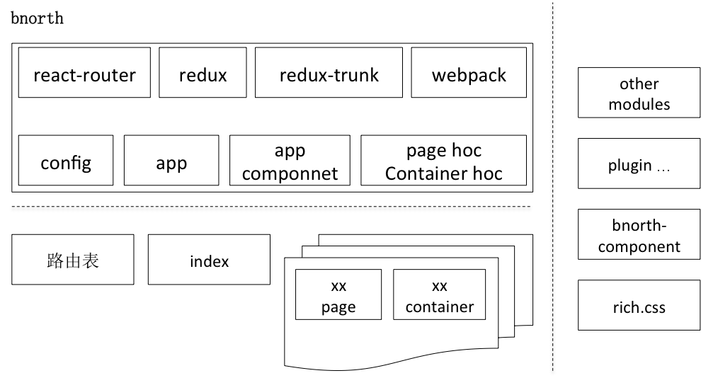

# bnorth

bnorth 是基于react 生态的一站式快速开发框架。提供页面路由，redux数据流等基本功能，和通过可扩展的插件机制提供的支撑整个应用运行的功能。内置的脚手架能提高开发效率和通过 [cordova](http://cordova.apache.org/)，[electron](https://github.com/electron/electron) 等实现跨平台混合开发。


## Why bnorth

1. react 是一个生态，存在大量优秀的库能协同开发出优秀的项目，同时也带来了学习上的成本。为此bnorth 以最佳实践为目的，提供一站式的快速开发方案。
1. react社区 有很多优秀的框架，如dvajs 等，但是着眼点都是在框架层面。而bnorth 是完整的解决方案：
    * 提供了mvc框架结构
    * 提供了丰富的脚手架功能
    * 提供了丰富的能力扩展，包括用户信息与鉴权，网络请求数据与管理，页面数据管理，数据格式化与校验，浏览器操作与导航，数据储存，数据处理等
    * bnorth-components 提供了丰富的UI 组件
    * rich.css 通过富class 方式提供丰富的css 样式类，无需或极少编写css 即可开发样式复杂的页面，并通过样式大量复用整体缩小css 代码尺寸
1. bnorth 通过脚手架与cordova，electronjs等结合，实现跨不同手机与桌面平台的混合开发。


## Getting Started

### 作为整体方案使用

**安装与使用**

```bash
$ npm init [-f]       # 初始化package.json和项目基本信息
$ npm install bnorth  # 安装，并自动启动bnorth脚手架，建立模板工程
```

**本地开发调试**

```bash
$ npm start
```

**打包发布**

```bash
$ npm run build
```

### 作为MCV框架使用

**安装**

安装前，在package.json中添加 *bnroth: false* 键值对，来禁用脚手架

```bash
$ npm i bnroth
```

**使用**

```js
import App from 'bnorth/lib/base/app';
let app = App.instance({
  plugin:{
    onImportRoutes(app) {
      app.routes = require('./routes');
    },
  },
})
app.start();
```


## Docs 

**[详细文档链接](https://able99.github.io/bnorth)**


## 特性

### bnorth 脚手架

**目前实现的脚手架功能**

```bash
$ npm install bnroth         # 安装bnroth插件时，自动初始化bnorth示例工程

$ npm run bnroth project all # 建立模板工程| 参数all(全部), project(项目文件，如.gitignore) ,src(代码文件)
$ npm start                  # 启动调试服务器
$ npm run build              # 打包
$ npm run build -- --debug   # 生成debug模式包
$ npm run build -- --analyze # 生成依赖库图标，用来分析依赖库size

```

**计划添加的脚手架功能**

1. cordova助手
1. electronjs助手
1. 新建page助手


### 工程配置

bnorth 编译与调试基于优秀的webpack 方案，提供了强大的便捷的功能，并可以通过工程配置文件，修改与扩充功能。

1. 编译的控制，比如输出的路径，输出文件是否使用hash 文件名，是否生成调试符号文件等
1. webpack 的定制配置
1. 调试服务器的网络代理配置
1. 调试服务器的mock 数据配置

**[具体参见链接](./ProjectConfig.md)**


### MVC 框架



1. App 是应用的入口和功能的挂载点。将App 实例化后，调用 app 的start 函数启动应用。
1. app 启动时，触发各个启动阶段的事件，应用的index 模块实现需要的事件的回调函数，实现对应用的定制。其中最重要的是在onImportRoutes事件中，返回用户定制的路由映射表。
1. bnorth 使用 [react-router3](https://github.com/ReactTraining/react-router/) 实现浏览器地址与页面的路由映射功能。
1. 各个页面由页面page 组件和页面container 组件组合而成。页面page 组件是纯react 组件，负责页面描画。页面container 组件是个函数，对container 模板进行定制，用以实现页面的逻辑。container 与 react-router 为页面page 组件的高阶组件，为其提供数据和方法。因此页面page 组件可通过props 获取数据并显示，实现无状态化的纯组件。container 通过 [redux](https://github.com/reactjs/redux) 为其提供数据的流动和方法。
1. redux 是统一的数据管理仓库，通过 [react-redux](https://github.com/reactjs/react-redux) 将页面与仓库进行连接，以获取相关数据。并提供actions 以操作数据的流动。数据流动时，在container 配置的与流动数据相关的页面将会更新显示。
1. container 模板的配置包括：
    * **states** 将app 中的各类数据流管理器添加进来，比如页面数据管理，比如网络数据请求等
    * **reduxers** 声明需要 redux 数据仓库中的指定数据
    * **actions** 为页面page 组件提供方法
    * **handlers** 提供页面生命周期事件和各种应用事件的处理函数
1. app 可添加插件，为其提供属性和方法，提供丰富的state 和 actions 。丰富的功能适应不同需求的应用开发。


### 插件与功能扩展

bnorth 通过插件机制，分离代码，提供功能。提高整体的灵活性和可扩展性。
插件实际是包含一系列事件处理函数的对象，插件添加到app 后，app在事件触发时，会遍历插件列表，逐一调用。任何一个插件处理后，返回 `true` 将终止事件的继续调用。比如实现了显示通知消息的插件，处理后需要终止调用，防止多个插件同时显示消息。
插件中的函数在不同阶段被触发调用时，可以修改和访问app 中的属性和方法，还可以增加新的属性与方法

**插件使用**
bnorth 方案提供了丰富的组件，与bnorth 分离，使用时import 进来，并添加到app 中
```js
app.use(plugin);
```

**插件开发**
定义一个对象，实现name 属性，和相关的事件处理函数。
```js
let plugin = {
  name: 'xxx',
  init(app) {
    ... // 在插件添加时执行初始化，比如修改app 的属性，比如添加actions
  },
  xxx(app) {
    ... // 在app 各个startEvents 事件中，或者trigger 的特定事件时执行，同上
  }
}
```


### 定制化

bnorth 的默认行为可满足一般性的应用开发，同时为特殊需求的应用提供定制化的能力，包括修改运行期配置和hook 的方式。

1. app.config 是基于bnorth 的应用的配置类，通过配置可改变bnorth 方案的默认行为，具体可参见 **[config](https://able99.github.io/bnorth/#/?name=%2Fapp%2Fconfig)** 
1. bnorth 及其插件都是将功能挂在到App 的实例对象上。在任何时刻可以通过直接修改app 上的方法与属性的方式进行定制化。一般是在app 启动的hook阶段，在其回调函数中进行定制化修改。比如：

```js
let app = App.instance({
  plugin:{
    onHook(app) {
      // 在原函数上增加某些处理
      app.browser.xxx = function(...args){
        ... // 增加某些处理
        return app.Browser.prototype.xxx.apply(this, args);
      }

      // 直接修改原函数
      app.Browser.prototype.xxx = function(...args) {
        ... // 修改原函数
      }
    },
  },
});
```


### bnorth 方案

bnorth 是完整h5 web 应用以及 混合app 开发方案

* bnorth 提供mvc 框架，脚手架以及其他功能
* [bnorth-components](https://github.com/able99/bnorth-components) 提供UI 组件
* [rich.css](https://github.com/able99/rich.css) 提供 css 样式类
* [doxer](https://github.com/able99/doxer) 提供自动化文档生成与显示
* [able99 githug home](https://github.com/able99) 提供了大量demo 与模板


## 关于roadhog

bnorth 脚手架的react 编译基本上从 [roadhog](https://raw.githubusercontent.com/sorrycc/roadhog) clone 来，并将保持持续跟踪。roadhog 功能十分强大，但是单位的一些特殊的需求，不得不修改node_modules下的配置。为了方便和bnorth 的发展，clone 并形成了bnorth 脚手架。


## 感谢

感谢github 开源社群，感谢roadhog, dvajs, antd, react-bootstrap 等优秀项目的帮助和灵感


## LICENSE

MIT